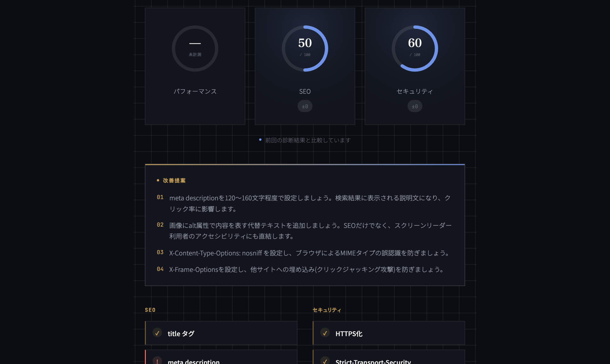

# Site Check — Backend

URLを1つ受け取り、SEO・セキュリティ・パフォーマンスの基本項目を無料で診断して返すAPIです。
[フロントエンド](https://github.com/yukisatodev/site-check-frontend-)と対になっています。

- 公開URL: https://effulgent-dodol-5d27d4.netlify.app/
- フロントエンド: [site-check-frontend](https://github.com/yukisatodev/site-check-frontend-)
- 設計判断の詳細: [site-check-DECISIONS.md](site-check-DECISIONS.md)


このAPIが返す診断結果は、フロントエンドで以下のように表示されます（スコア・前回比較・改善提案・チェックリスト）。



---

## 1. 背景・課題

企業のDX推進・Web制作支援の実務を通じて、「サイトを作って終わり」ではなく「公開後も健全な状態を保てているか」を継続的に確認できる仕組みが求められる場面を何度も見てきました。有償のSEO/セキュリティ診断ツールは多くありますが、

- 個人開発の検証段階では費用をかけづらい
- 診断結果だけ出て、次に何をすべきかまでは教えてくれないものが多い
- 一度診断して終わりで、改善の推移を追えない

という課題があると考え、「無料・改善提案つき・履歴比較つき」を満たす自分用の診断ツールとして着手しました。

## 2. 要件定義

### 2.1 想定ユーザー

- 自分のサイト・クライアントのサイトを、公開後も定期的にセルフチェックしたい個人開発者・小規模事業者
- 初回商談前に、相手企業のサイトの現状を無料で把握したい制作会社の営業担当

### 2.2 機能要件

| ID | 要件 | 対応状況 |
|---|---|---|
| F-1 | URLを入力するだけで診断を実行できる | ✅ |
| F-2 | SEOの基本項目（title / meta description / h1 / img alt）を診断する | ✅ |
| F-3 | セキュリティの基本項目（HTTPS / HSTS / X-Content-Type-Options / X-Frame-Options）を診断する | ✅ |
| F-4 | パフォーマンススコアを取得する（Google PageSpeed Insights連携時） | ✅（APIキー未設定時は「未計測」） |
| F-5 | 同じURLを再診断した際、前回結果との差分を表示する | ✅ |
| F-6 | 過去の診断履歴を一覧で取得できる | ✅ |
| F-7 | 診断結果をPDFレポートとしてダウンロードできる | ✅ |
| F-8 | 項目ごとに、問題がある場合は具体的な改善提案を返す | ✅ |

### 2.3 非機能要件

| 区分 | 内容 |
|---|---|
| 可用性 | 個人開発の無料枠運用のため、常時100%稼働は保証しない（Renderの無料インスタンスはアイドル時にスリープする） |
| セキュリティ | パスワード等の機密情報は扱わない（認証機能を持たない）。CORSはオープン設定だが、書き込み対象は診断結果のみで、外部からの任意書き込みリスクは低い |
| 拡張性 | 診断項目を`diagnostics.py`に関数として追加していくだけで拡張できる構成にしている |
| 保守性 | 診断ロジック（`diagnostics.py`）、DBアクセス（`database.py`）、レポート生成（`report.py`）、ルーティング（`main.py`）を責務ごとに分離している |

## 3. 診断ロジック（採点基準）

### SEO（各25点、満点100点）

| 項目 | 内容 |
|---|---|
| title | `<title>`タグの有無 |
| meta description | `<meta name="description">`の有無 |
| h1 | `<h1>`が過不足なく1つだけ存在するか |
| img alt | 全``のうち、`alt`属性が設定されている割合 |

### セキュリティ（HTTPS 40点、その他各20点、満点100点）

| 項目 | 内容 |
|---|---|
| HTTPS | URLが`https://`で始まっているか |
| HSTS | `Strict-Transport-Security`ヘッダーの有無 |
| X-Content-Type-Options | `nosniff`が設定されているか |
| X-Frame-Options | ヘッダーの有無（クリックジャッキング対策） |

### パフォーマンス（0〜100点、任意）

Google PageSpeed Insights API（モバイル基準）のLighthouseスコアをそのまま利用。APIキーを環境変数`PAGESPEED_API_KEY`に設定した場合のみ計測し、未設定時は`null`を返す（フロント側で「未計測」と表示）。

## 4. データ設計

```
diagnosis_results
├─ id               INTEGER PRIMARY KEY
├─ url              STRING (index)
├─ created_at       DATETIME (index)
├─ performance_score INTEGER (nullable)
├─ seo_score        INTEGER
├─ security_score   INTEGER
└─ details_json     JSON   -- 項目ごとのok/note/suggestionを保持
```

同一URLでも診断のたびに新しい行を追加する（上書きしない）ため、そのまま履歴・推移として扱える。

## 5. API仕様

| Method | Path | 概要 |
|---|---|---|
| POST | `/api/diagnose` | URLを診断し、結果をDBに保存して返す。同一URLの前回結果があれば差分(`diff`)も返す |
| GET | `/api/history/{url}` | 指定URLの過去の診断結果を最大20件、新しい順で返す |
| GET | `/api/report/{result_id}` | 指定した診断結果のPDFレポートを生成して返す |

リクエスト/レスポンスの詳細なスキーマは`app/main.py`のPydanticモデル（`DiagnoseRequest` / `DiagnoseResponse`）を参照。

## 6. 技術選定

| 技術 | 採用理由 |
|---|---|
| FastAPI | Pydanticによる型安全なリクエスト/レスポンス定義と、自動生成される`/docs`（Swagger UI）で開発効率を優先 |
| SQLAlchemy + SQLite | まずローカルで完結させ、`DATABASE_URL`を差し替えるだけでPostgres等クラウドDBに移行できる構成にした |
| BeautifulSoup | HTML解析はscraping用途で実績のあるライブラリに任せ、診断ロジックの実装に集中 |
| reportlab | PDFレポート生成。日本語表示のため、Noto Sans JPを必要な文字だけサブセット化して埋め込んでいる |

## 7. セットアップ

```bash
pip install -r requirements.txt
uvicorn app.main:app --reload
```

`http://127.0.0.1:8000/docs` でSwagger UIからAPIを直接試せる。

環境変数（任意）:

```
PAGESPEED_API_KEY=xxxx   # 未設定でもSEO/セキュリティ診断は動作する
DATABASE_URL=sqlite:///./diagnostics.db  # 省略時のデフォルト
```

## 8. 今後の課題

- パフォーマンス計測をPageSpeed Insights依存から、より軽量な自前計測（Lighthouse CI等）へ拡張
- 診断項目の追加（構造化データ、OGP、robots.txt/sitemap.xmlの有無など）
- 定期診断（cronでの自動再診断とアラート通知）
